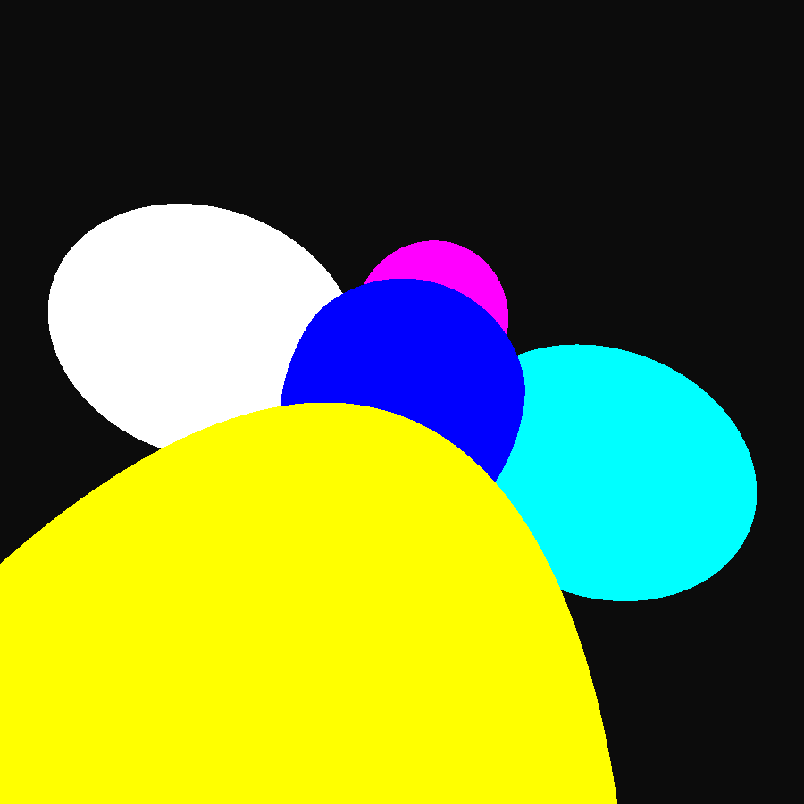
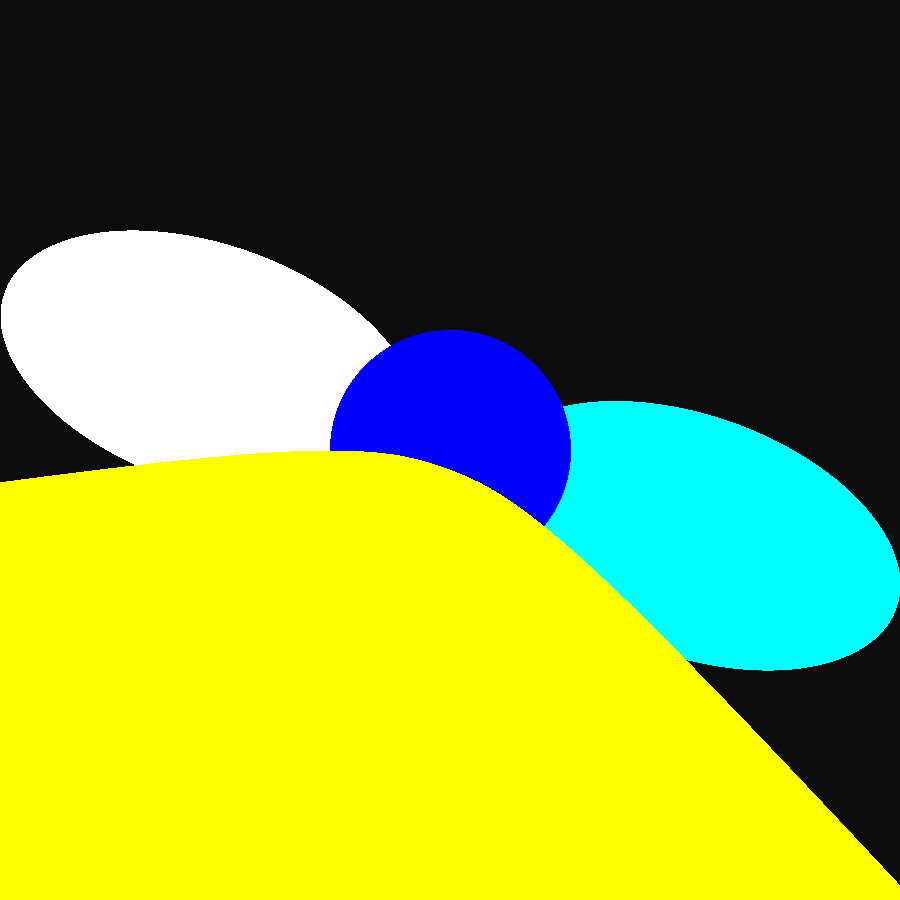
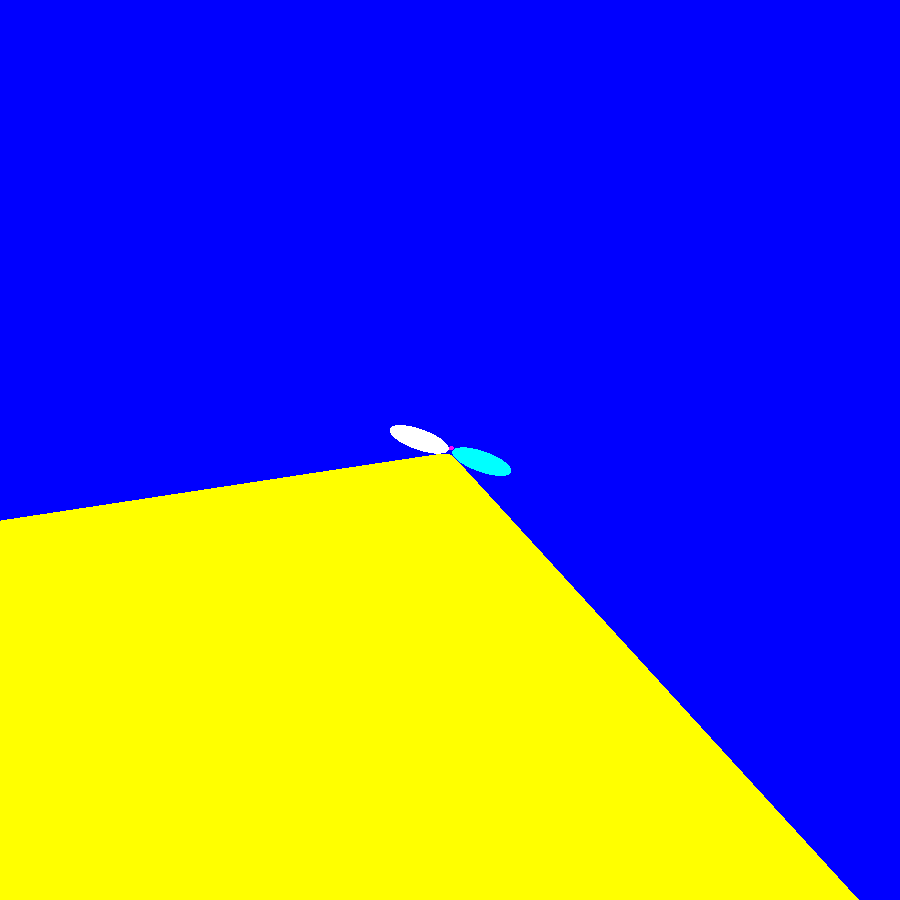

# Raytracer 

Author: Mason J Hawver

# HW 1a Writeup

1) How does the apparent rotation of the scene with respect to the viewpoint change with changes in the direction of the ‘up’ vector?

When the up vector's projection on the plane normal to the view direction is rotated the apparent rotation is also rotated with it linearly. This can be seen in image 1 and 2 when image 2 up vector is moved on the x axis to rotate the image.


params:
* eye      0.0 -10.0 -10.0
* viewdir  0.0 1.0 1.0
* updir    0.25 1.0 0.0
* vfov     60.0


params:
* eye      0.0 -10.0 -10.0
* viewdir  0.0 1.0 1.0
* updir    0.25 1.0 0.0
* vfov     60.0

2)  How do changes in the field of view settings affect the appearance of the scene in your rendered image?

Decresing the fov zooms in the image, this can be seen in the first to images when the fov is decreased from 90 in img 2 to 60 in image 1. Increasing the fov distorts the image this can be seen in the last image where I drastically increave the fov to 120 and move the eye closser so it can be seen clearer.


params:
* eye      0.0 -10.0 -10.0
* viewdir  0.0 1.0 1.0
* updir    0.25 1.0 0.0
* vfov     60.0


params:
* eye      0.0 -10.0 -10.0
* viewdir  0.0 1.0 1.0
* updir    0.25 1.0 0.0
* vfov     90.0




params:
* eye      0.0 -3.0 -3.0
* viewdir  0.0 1.0 1.0
* updir    0.25 1.0 0.0
* vfov     120.0

3) How can the viewing parameters (e.g. the camera location, field of view settings, …) be adjusted to achieve a less exaggerated vs more exaggerated amount of apparent perspective distortion in your image?

If you get really close to the objects and increase the fov it distorts the image and becomes more exagerated as you get closer and as the fov aproached 180, this can be seen in the images bellow.


params:
* eye      0.0 -3.0 -3.0
* viewdir  0.0 1.0 1.0
* updir    0.25 1.0 0.0
* vfov     120.0



params:
* eye      0.0 -2.0 -2.0
* viewdir  0.0 1.0 1.0
* updir    0.25 1.0 0.0
* vfov     150.0



params:
* eye      0.0 -1.0 -1.0 #inside the blue sphere and see the other intersected inside
* viewdir  0.0 1.0 1.0
* updir    0.25 1.0 0.0
* vfov     179.0

# HW 1a Submission

./final/hw1a_final.ppm is the final submission image.

# Code Structure

 * ./include -> stores header files, the header files are commented so go there for additional documentation.
 * ./include/core -> headers for core data structures: arena allocator
 * ./include/math -> headers for vectors, rays, spheres, perlin noise, and common math functions and structures
 * ./include/util -> headers for file i/o and a lexer for file parsing
 * ./include/resources -> headers for image and scene loading and manipulation **(ie ray tracing happens in scene.h and scene.c)**
 * ./src -> stores source files for each header file, it mirrors the structure of ./include
 * ./assets -> input files for the program, .in files represents the scene
 * ./out -> files outputted by the program
 * ./bin -> resulting programs
 * ./final -> final images I'm submitting
 * ./script -> python files used to generate data used by the program (for perlin noise and assets/balls.in)
 * ./ftr -> files that aren't relevent to the submission, but I wrote them anyway
 * ./ -> stores main functions and Makefiles and README.md

# Running the Code

I'm only sure it will work on linux x86, VIEW is the program that displays the output image.

If you have feh, run:
```
make hw1a VIEW=feh
```

else, run and find a way to view ./out/:
```
make hw1a VIEW=echo
```

To just compile the program, then run it
```
make ./bin/hw1a
./bin/hw1a <input file name> <output file name>
```

<details>
  <summary>HW 0</summary>
  
# HW 0

hw0_final.ppm is the image I'm turning in for assignment 0. hw0_alt.ppm is another image my program produced using the alt settings commented in assets/hw0.in.

hw0.c holds the main function for assignment 0. It first loads a scene from assets/hw0.in. it Then loads an image from assets/initials.ppm. it Then creates an image using the scene parameters and perlin noise. And finally it mixes the image I loaded with the generated image, and saves the result to assets/hw0.ppm

</details>