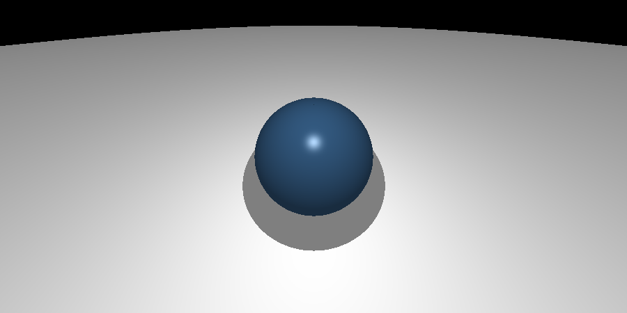
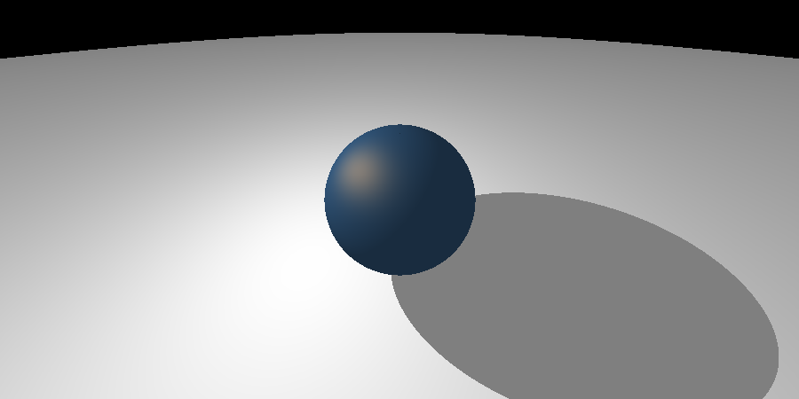

# Raytracer 

Author: Mason John Hawver \
Class: CSCI 5607

# Gallery

hw1c showcase img (./showcase_hw1c.png): 


<details>
  <summary> old showcase imgs </summary>


</details>

# Compiling and Running

Compiling and Running on Linux-x86: (If not use the use the corresponding programs on your system)
```
cd <path to hw1c.mason.hawver>
make all
./raytracer1c <input file name> <optional: output file name>
``` 

Example Usage:
```
./raytracer1c ./assets/scenes/hw1b.in ./hw1b.ppm
feh ./hw1b.ppm #view image

./raytracer1c ./assets/scenes/hw1b.in 
feh ./assets/scenes/hw1b.ppm #view image
```

# Code Structure

 * ./include -> stores header files, the header files are commented so go there for additional documentation.
 * ./include/core -> headers for core data structures, io, and parsing
 * ./include/math -> headers for vectors, rays, spheres, perlin noise, and common math functions and structures
 * ./include/resources -> headers for image and scene loading and saving
 * ./include/raytracer -> headers for ray casting, shading, and a bvh
 * ./src -> stores source files for each header file, it mirrors the structure of ./include
 * ./ -> stores main functions and Makefiles, README.md, and raytracer1b
 
 less important:

 * ./assets -> a bunch of files 
 * ./bin -> all programs generated so far
 * ./tests -> my unit tests

# HW1c Writeup


The reference Image for this scene was notably distorted compared to mine; I'm assuming there is something wrong with your code. The scene file for this is in ./assets/scenes/hw1c.in.

The scene files for the two showcase images: ./assets/scenes/bunny2.in ./assets/scenes/dragon.in

## Old HW Writeups

<details>
  <summary>HW0</summary>
  
# HW0 writeup

hw0_final.ppm is the image I'm turning in for assignment 0. hw0_alt.ppm is another image my program produced using the alt settings commented in assets/hw0.in.

hw0.c holds the main function for assignment 0. It first loads a scene from assets/hw0.in. it Then loads an image from assets/initials.ppm. it Then creates an image using the scene parameters and perlin noise. And finally it mixes the image I loaded with the generated image, and saves the result to assets/hw0.ppm

</details>


<details>
  <summary>HW1a</summary>

# HW1a Writeup

1) How does the apparent rotation of the scene with respect to the viewpoint change with changes in the direction of the ‘up’ vector?

When the up vector's projection on the plane normal to the view direction is rotated the apparent rotation is also rotated with it linearly. This can be seen in image 1 and 2 when image 2 up vector is moved on the x axis to rotate the image.


params:
* eye      0.0 -10.0 -10.0
* viewdir  0.0 1.0 1.0
* updir    0.25 1.0 0.0
* vfov     60.0


params:
* eye      0.0 -10.0 -10.0
* viewdir  0.0 1.0 1.0
* updir    0.25 1.0 0.0
* vfov     60.0

2)  How do changes in the field of view settings affect the appearance of the scene in your rendered image?

Decresing the fov zooms in the image, this can be seen in the first to images when the fov is decreased from 90 in img 2 to 60 in image 1. Increasing the fov distorts the image this can be seen in the last image where I drastically increave the fov to 120 and move the eye closser so it can be seen clearer.


params:
* eye      0.0 -10.0 -10.0
* viewdir  0.0 1.0 1.0
* updir    0.25 1.0 0.0
* vfov     60.0


params:
* eye      0.0 -10.0 -10.0
* viewdir  0.0 1.0 1.0
* updir    0.25 1.0 0.0
* vfov     90.0


params:
* eye      0.0 -3.0 -3.0
* viewdir  0.0 1.0 1.0
* updir    0.25 1.0 0.0
* vfov     120.0

3) How can the viewing parameters (e.g. the camera location, field of view settings, …) be adjusted to achieve a less exaggerated vs more exaggerated amount of apparent perspective distortion in your image?

If you get really close to the objects and increase the fov it distorts the image and becomes more exagerated as you get closer and as the fov aproached 180, this can be seen in the images bellow.


params:
* eye      0.0 -3.0 -3.0
* viewdir  0.0 1.0 1.0
* updir    0.25 1.0 0.0
* vfov     120.0


params:
* eye      0.0 -2.0 -2.0
* viewdir  0.0 1.0 1.0
* updir    0.25 1.0 0.0
* vfov     150.0


params:
* eye      0.0 -1.0 -1.0 #inside the blue sphere and see the other intersected inside
* viewdir  0.0 1.0 1.0
* updir    0.25 1.0 0.0
* vfov     179.0
</details>


<details>
  <summary>HW1b</summary>


# HW1b Extra credit
  
**Depth Cueing**:


depthcueing 0 0 0 1 .05 100 40

**Attenuated Lights**:


attlight 0 20 20   1  1 1 1  1 .001 .001 \
attlight 0 20 200   1  1 1 1  1 .001 .001 \
attlight 200 20 200   1  1 1 1  1 .001 .001 \
attlight -200 20 200   1  1 1 1  1 .001 .001

# HW1b Writeup

1:

**Ambient Reflection**: \
low values of ka produce materials that absorb more light making them appear darker. This is suitable for matte surfaces like clay or chalk.


mtlcolor 0.4 0.0 1.0  1 1 1  0.0 0.8 0.2  10

high values of ka produce brighter objects that scatter more light. This is suitable for metallic objects.


mtlcolor 0.4 0.0 1.0  1 1 1  0.6 0.1 0.3 100

**Diffuse Reflection**: \
low values of kd produce rough objects that are less likely to scatter light in all directions. This is suitable for plastics and other rough surfaces.


mtlcolor 0.4 0.0 1.0  1 1 1  0.8 0.1 0.1 10

high values of kd produce rough objects that are less likely to scatter light in all directions. This is good for paper.


mtlcolor 0.4 0.0 1.0  1 1 1  0.1 0.6 0.3 10

**Specular Reflection**: \
low values of ks produce materials that have less sharp highlights. This is suitable for materials like wood or clay.


mtlcolor 0.4 0.0 1.0  1 1 1  0.5 0.5 0.0 30

high values of ks produce materials with strong specular highlights. This is suitable for polished metals. 


mtlcolor 0.4 0.0 1.0  1 1 1  0.1 0.2 0.7 300

**Specular Exponent**: \
low n values produce broad diffuse highlights which is good for materials like skin and some fabrics.


mtlcolor 0.4 0.0 1.0  1 1 1  0.4 0.2 0.4 2

high n value create tight, sharp highlights. This is suitable for materials like polished metals or ceramics.


mtlcolor 0.4 0.0 1.0  1 1 1  0.25 0.25 0.5 100

**Diffuse Color**:

The diffuse color controls the base color of the object.



mtlcolor 0.4 0.7 1.0  1 1 1  0.25 0.25 0.5 10

**Specular Color**:

The specular color controls the color of specular highlights independent of the diffuse color.


mtlcolor 0.4 0.7 1.0  .7 .4 .1  0.25 0.25 0.5 10

**Shortcomings of Blinn-Phong**: \
The Blinn-Phong model can't represent translucent materials, sub-surface scattering, volumetric objects, or the fresnel effect - to just name a few.


**Point vs Directional Lights**: \
A point light is a finite distance away from every point in the scene v.s. a directional light is infinitely far away and is only described by its direction. A directional light is more suitable for representing the sun where points lights are used to mimic light bulbs.

eye      0 20 0 \
sphere   0.0 0.0 20.0 10.0



light 20 20 20   1 1 1 1


light -1 -1 0   0 1 1 1

When the point light is placed close to an object its shadow is warped on the surface, where the directional light almost seems to paint a perfect circle onto the surface.

**Multiple Lights**:
multiple lights force shadows to be mixed, currently this is done additively. It also forces the scene to be overall damper so when two lights overlap the result can be shown without overloading the light intensity.


light 20 20 20   1 .33 .33 .33 \
light -20 20 20  1 .33 .33 .33 \
light 0 20 20    1 .33 .33 .33 

</details>